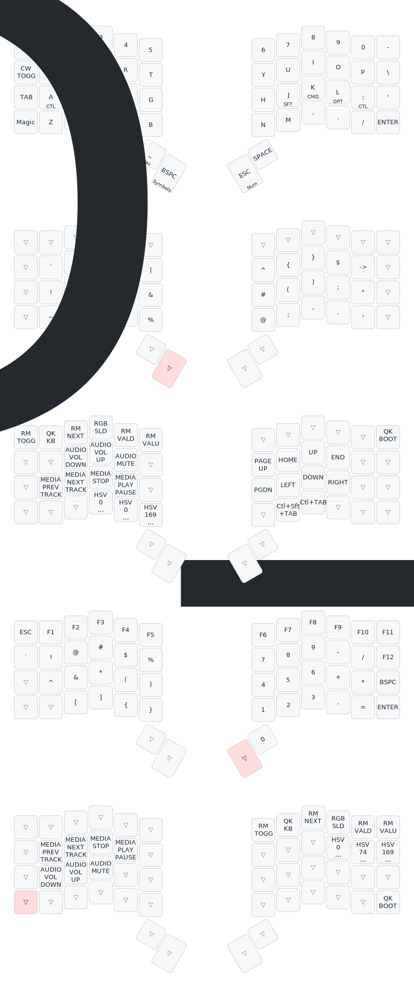

# ZSA Voyager QMK Keymap

Personal QMK external userspace repository for the ZSA Voyager.

This repository intentionally contains only one keymap:

```text
keyboards/zsa/voyager/keymaps/zwang695
```

The keymap source is based on the Oryx export for `voyager-default-mac`:

```text
https://configure.zsa.io/voyager/layouts/lBWEb/ZPG0o5/0
```

It keeps the Oryx-generated `config.h`, `rules.mk`, and layout metadata while
building from this repository through QMK external userspace.

## Keymap Diagram



The diagram is generated with
[`keymap-drawer`](https://github.com/caksoylar/keymap-drawer). After setting up
the QMK CLI below, install `keymap-drawer` and redraw with:

```sh
pipx install keymap-drawer
scripts/draw-keymap.sh
```

## Local Setup

Install the QMK CLI, then set up upstream QMK:

```sh
qmk setup qmk/qmk_firmware
```

Configure this repository as your QMK external userspace:

```sh
qmk config user.overlay_dir="$(realpath .)"
```

## Build

Compile the Voyager keymap directly:

```sh
qmk compile -kb zsa/voyager -km zwang695
```

Or compile all userspace targets from `qmk.json`:

```sh
qmk userspace-compile
```

GitHub Actions also builds this keymap against `qmk/qmk_firmware@master`
on every push and manual workflow dispatch.
